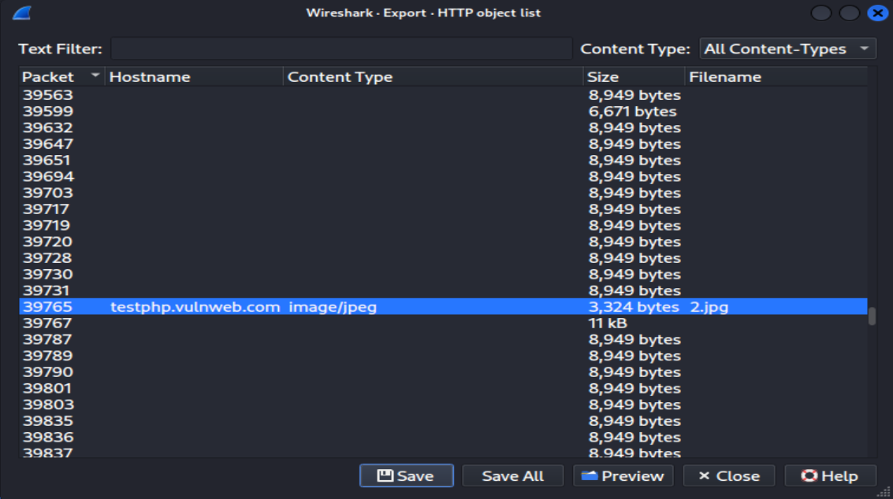

# Lab: Wireshark the Basics and Wireshark Packet Operations

> [!NOTE]
> **Contexto y Objetivo:** Auditoría e inspección profunda de paquetes sobre la captura `Exercise.pcapng` para identificar servicios web activos, evaluar transacciones HTTP no cifradas y aislar tráfico anómalo mediante filtros de visualización intermedios y avanzados.
>
> **Resultado / Causa Raíz:** Detección de servidores Microsoft IIS mediante expresiones regulares, identificación de transferencias de archivos en texto plano y extracción de artefactos forenses sin cifrado en capa de aplicación.

---

## 1. Alcance y Superficie (Target Scope)

| Parámetro                       | Detalle Técnico                                                                              |
| :------------------------------ | :------------------------------------------------------------------------------------------- |
| **Objetivo / Host**             | Archivo `Exercise.pcapng` / Tráfico HTTP y consultas DNS                                     |
| **Entorno / Sistema Operativo** | Pila TCP/IP (L2 Ethernet II, L3 IPv4, L4 TCP/UDP, L7 HTTP/DNS)                               |
| **Herramientas Clave**          | Wireshark v4.x                                                                               |
| **Vector / Foco de Auditoría**  | Disección L7, detección de cabeceras Server, filtrados Regex y reconstrucción de streams TCP |

---

## 2. Metodología e Inspección Técnica

### Fase 1: Triaje Inicial y Reconocimiento

- **Objetivo de la fase:** Mapear la distribución de protocolos de red, identificar endpoints dominantes y evaluar la superficie de exposición general del archivo `Exercise.pcapng`.
- **Comandos / Filtros ejecutados:**

```text
Menu: Statistics -> Protocol Hierarchy
Menu: Statistics -> Conversations (IPv4 / TCP)
Filtro base: http || dns
```

- **Análisis de resultados:** Se identificó tráfico web sin cifrar (HTTP/1.1) conviviendo con transacciones DNS en texto plano. La jerarquía muestra predominancia de flujos TCP en puertos estándar (80) y no estándar (4444, 3333), lo que justifica aislar transacciones de capa de aplicación e inspeccionar servidores web específicos.

---

### Fase 2: Inspección Profunda / Aislamiento / Explotación

- **Objetivo de la fase:** Aislar servidores Microsoft IIS activos, identificar versiones específicas y correlacionar propiedades de Capa 3 (TTL) y Capa 4 (puertos origen).
- **Consultas / Filtros aplicados:**

```text
# 1. Detección de servidores IIS excluyendo el puerto estándar 80
http.server contains "IIS" && !(tcp.srcport == 80)

# 2. Búsqueda de versión exacta mediante expresiones regulares (Regex)
http.server matches "IIS/7\.5"

# 3. Inspección de paridad en cabeceras L3 (TTL par para fingerprinting pasivo)
string(ip.ttl) matches "[02468]$"

# 4. Aislamiento de puertos de servicio alternativos
tcp.port in {3333 4444 9999}
```

- **Hallazgos:** Se detectó la presencia de servidores `Microsoft-IIS/7.5` operando en puertos alternativos. El filtrado por expresiones regulares confirmó paquetes originados con TTL par (consistentes con sistemas Windows emitiendo con TTL inicial de 128 tras saltos de enrutamiento), descartando tráfico espurio mediante negación lógica envolvente.

---

### Fase 3: Extracción de Artefactos y Evidencia

- **Datos recuperados:**
  - Reconstrucción de sesión mediante _Follow HTTP Stream_ en la secuencia `33790`, exponiendo listados de recursos en texto plano.
  - Extracción forense de archivos transferidos vía _File -> Export Objects -> HTTP_, recuperando artefactos `.txt` y recursos multimedia sin alteración de hash.
- **Evidencia visual:**



- **Validación de Integridad Forense:**

```bash
# Navegación al directorio de extracción y cálculo de hash MD5
cd ~/Documents
md5sum image-found
# 911cd574a42865a956ccde2d04495ebf  image-found
```

---

## 3. Causa Raíz y Mecanismos de Detección

- **Causa Raíz:** Transmisión de activos y datos de sesión mediante protocolo HTTP/1.1 en texto plano a través de puertos estándar y alternativos, exponiendo metadatos de arquitectura en cabeceras (`Server: Microsoft-IIS/7.5`) y permitiendo la reconstrucción íntegra de archivos transferidos por falta de cifrado en capa de aplicación.
- **Filtro de Detección en Tráfico Capturado (Wireshark):**

```text
http.response && (http.server contains "IIS/7.5" || http.content_type contains "image/jpeg")
```

---

## 4. Medidas de Mitigación y Hardening

- [ ] **Medida Preventiva:** Forzar cifrado en tránsito mediante HTTPS/TLS 1.3, implementando redirección 301 obligatoria desde HTTP y habilitando cabeceras `Strict-Transport-Security` (HSTS).
- [ ] **Medida Correctiva:** Segmentar la red y restringir puertos web anómalos (3333, 4444) mediante firewall perimetral; ocultar o sanitizar la cabecera `Server` en Microsoft IIS para prevenir _banner grabbing_ pasivo.
- [ ] **Actualización / Parche:** Descontinuar versiones obsoletas como IIS 7.5 (fuera de soporte oficial / EOL) y migrar a servidores web con soporte activo y suites de cifrado seguras.

---

## 5. Lecciones Aprendidas & Snippets Reutilizables

- **Concepto Clave Consolidado:** La evaluación booleana en Wireshark requiere sintaxis de negación envolvente `!(campo == valor)` para evitar falsos positivos derivados de campos con múltiples instancias. El análisis combinado de paridad TTL y cabeceras L7 permite ejecutar _fingerprinting_ pasivo del sistema operativo sin enviar un solo paquete a la red.
- **Snippet / Comando Reutilizable:**

```text
# Detección de servidor web específico en puertos alternativos
http.server contains "IIS" && !(tcp.srcport == 80)

# Filtrado de paridad en campos numéricos L3 (TTL) mediante conversión de tipos
string(ip.ttl) matches "[02468]$"

# Aislamiento rápido de múltiples puertos no estándar
tcp.port in {3333 4444 9999}
```
